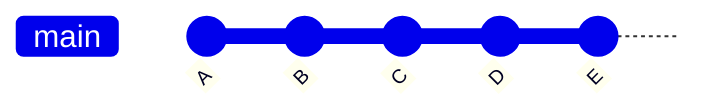

# Git & GitHub — Field Guide for Automation Engineers

> A reference for engineers and technicians who did not come up through software but now need to version-control code, documentation, schematics, and deliverables. Written plainly, with diagrams, and with the binary-file reality of our trade treated as a first-class concern rather than an afterthought.

---

## Table of Contents

1. [Why Git, and Why Automation Engineers Keep Getting Burned by It](#1-why-git-and-why-automation-engineers-keep-getting-burned-by-it)
2. [The Mental Model: Git Is a Graph, Not a Folder](#2-the-mental-model-git-is-a-graph-not-a-folder)
3. [The Three Trees: Working, Index, HEAD](#3-the-three-trees-working-index-head)
4. [Setup and First-Time Configuration](#4-setup-and-first-time-configuration)
5. [The Basic Loop: Add, Commit, Push](#5-the-basic-loop-add-commit-push)
6. [Branches: What They Actually Are](#6-branches-what-they-actually-are)
7. [Remotes: Origin, Upstream, Fetch vs. Pull](#7-remotes-origin-upstream-fetch-vs-pull)
8. [Merging: Fast-Forward vs. Three-Way](#8-merging-fast-forward-vs-three-way)
9. [Rebasing: What It Really Does](#9-rebasing-what-it-really-does)
10. [Squashing and Interactive Rebase](#10-squashing-and-interactive-rebase)
11. [Ahead, Behind, and Both at the Same Time](#11-ahead-behind-and-both-at-the-same-time)
12. [Conflicts: Reading Them and Resolving Them](#12-conflicts-reading-them-and-resolving-them)
13. [Undoing Things: Reset, Revert, Restore, Reflog](#13-undoing-things-reset-revert-restore-reflog)
14. [Stashing](#14-stashing)
15. [Tags and Releases — Tying Git to Plant State](#15-tags-and-releases--tying-git-to-plant-state)
16. [.gitignore and .gitattributes](#16-gitignore-and-gitattributes)
17. [Git LFS and the Binary File Problem](#17-git-lfs-and-the-binary-file-problem)
18. [Pull Requests: The GitHub Workflow](#18-pull-requests-the-github-workflow)
19. [Common Workflows: GitHub Flow, Git Flow, Trunk-Based](#19-common-workflows-github-flow-git-flow-trunk-based)
20. ["I Broke My Repo" — Recovery Scenarios](#20-i-broke-my-repo--recovery-scenarios)
21. [Glossary](#21-glossary)

---

## 1. Why Git, and Why Automation Engineers Keep Getting Burned by It

Git was built for text files that merge cleanly. That is not our world. We deal with PLC project archives, HMI runtime files, AutoCAD electrical drawings, PDFs, and compiled bytecode. Most of these are binary, and Git cannot merge them — it can only replace one with the other. This is the single most important thing to understand before you touch a repo with a `.ACD` or `.apa` file in it. Skip ahead to section 17 before you start storing PLC programs.

That said, Git is still the right tool. It gives you:

- A full history of every change to every file, with author and timestamp.
- The ability to branch off and experiment without fear of losing the known-good version.
- A mechanism for two or more engineers to work the same project and reconcile their changes — for text files automatically, for binary files through a locking discipline.
- Integration with GitHub, which provides review, issue tracking, and off-site backup.

The cost is a learning curve that is genuinely steep. Git's commands are not named to match what they do — `checkout` does four different things, `reset` does three, and `rebase` does something entirely different from what the word suggests. This guide tries to explain *what is actually happening* underneath, because once you see the model, the commands stop feeling arbitrary.

---

## 2. The Mental Model: Git Is a Graph, Not a Folder

A Git repository is not a folder of files with versions. It is a **directed acyclic graph** (DAG) of **commits**. Each commit is a complete snapshot of your project at a moment in time, plus a pointer to the commit (or commits) that came before it. Branches are just labels that point at one of those commits. That is the entire model.

Here is the simplest possible picture:

```
    (A) ─── (B) ─── (C) ─── (D)
                            ▲
                            │
                          main
```

Four commits, `A` through `D`. Each arrow means "my parent is." The label `main` is a pointer to commit `D`. When you make a new commit on top of `D`, Git creates commit `E`, sets its parent to `D`, and moves the `main` pointer forward to `E`:

```
    (A) ─── (B) ─── (C) ─── (D) ─── (E)
                                    ▲
                                    │
                                  main
```

Commits do not change. Once a commit exists, its contents and its parent are permanent and its hash (the 40-character SHA-1 identifier) is permanent with them. What moves is the branch *pointer*. Internalising this is the single biggest step up in Git fluency: **commits are immutable, branches are pointers, and almost every Git command is either creating a new commit or moving a pointer.**

Rendered as a Mermaid graph so GitHub shows it inline:



---

## 3. The Three Trees: Working, Index, HEAD

Inside your local repository, Git maintains three distinct "trees" — three separate views of your files that you move changes between.

```
 ┌────────────────────┐    git add      ┌────────────────────┐    git commit   ┌────────────────────┐
 │                    │  ────────────▶  │                    │  ────────────▶  │                    │
 │   WORKING TREE     │                 │   INDEX (STAGING)  │                 │   HEAD (REPO)      │
 │                    │  ◀────────────  │                    │  ◀────────────  │                    │
 │  what's on disk    │  git restore    │  what will be in   │  git reset      │  the last commit   │
 │  right now         │                 │  the next commit   │                 │  on current branch │
 └────────────────────┘                 └────────────────────┘                 └────────────────────┘
```

The **working tree** is the actual files in your project folder. You edit these directly.

The **index** (also called the staging area or cache) is a snapshot of what your next commit will look like. When you run `git add file.txt`, you are copying the current state of `file.txt` from the working tree *into* the index. The index is the rehearsal space — you build up exactly the snapshot you want, then commit it.

**HEAD** is a pointer to the current commit on the current branch. It represents "what the repo thinks the last committed state is." When you commit, Git takes the index, writes it as a new commit with HEAD as its parent, and then moves HEAD forward to the new commit.

`git status` is you asking Git to compare these three trees and tell you where each file stands.

```
$ git status
On branch main
Changes to be committed:          ← difference between INDEX and HEAD
  (use "git restore --staged <file>..." to unstage)
        modified:   routine_main.L5X

Changes not staged for commit:    ← difference between WORKING TREE and INDEX
  (use "git add <file>..." to update what will be committed)
        modified:   io_tags.csv

Untracked files:                  ← in working tree, unknown to index and HEAD
  (use "git add <file>..." to include in what will be committed)
        notes.md
```

Once you see the three trees, `git status` stops being cryptic and becomes a simple ledger.

---

## 4. Setup and First-Time Configuration

Install Git from <https://git-scm.com>. On Windows this includes Git Bash, which is where most of the command examples in this guide will run cleanly. Then, one time per machine:

```bash
git config --global user.name  "Your Full Name"
git config --global user.email "you@example.com"
git config --global init.defaultBranch main
git config --global pull.rebase false
git config --global core.autocrlf true        # Windows
git config --global core.autocrlf input       # macOS / Linux
```

The `user.name` and `user.email` get embedded in every commit you make — this is how authorship is recorded. Use the same email that is on your GitHub account so commits get attributed correctly in the web UI.

The `core.autocrlf` setting handles the Windows-versus-everyone-else line-ending war. On Windows, set it to `true` so Git converts line endings to Windows style on checkout and back to Unix style on commit. On macOS or Linux, use `input` so Git does not touch what is already correct.

For authentication to GitHub, do **not** use a password — GitHub no longer accepts them over HTTPS. Either create a personal access token (Settings → Developer settings → Personal access tokens) and use it as your password when Git prompts, or — better — set up an SSH key:

```bash
ssh-keygen -t ed25519 -C "you@example.com"
cat ~/.ssh/id_ed25519.pub
```

Copy the printed public key into GitHub at Settings → SSH and GPG keys → New SSH key. Then clone repos with the `git@github.com:...` URL instead of `https://github.com/...` and you will never be asked for credentials again.

---

## 5. The Basic Loop: Add, Commit, Push

Ninety percent of daily Git work is this loop:

```
  edit files  ──▶  git add  ──▶  git commit  ──▶  git push
     ▲                                                │
     └────────────────────────────────────────────────┘
                  (repeat)
```

In commands:

```bash
# See what you've changed
git status
git diff                          # changes not yet staged
git diff --staged                 # changes staged but not committed

# Stage specific files, or all changes
git add path/to/file.txt
git add .                         # everything in current directory
git add -p                        # interactive: review each change

# Commit with a message
git commit -m "Add PID tuning notes for CIP supply pump"

# Send to GitHub
git push
```

**On commit messages.** Write them as if the person reading is you in six months trying to figure out why you did this. The convention that has held up across the industry is a short imperative subject line (50 characters or less, no period), then a blank line, then a longer body explaining the *why* rather than the *what*.

```
Fix false-trip on tank-1 high-level interlock

The level sensor was reading briefly above setpoint during
agitator startup due to surface turbulence. Added a 500 ms
off-delay to the high-level bit before it latches the interlock.

Refs ticket #42.
```

`git commit` without `-m` opens your configured editor so you can write the body. Use it for any non-trivial change.

---

## 6. Branches: What They Actually Are

A branch is a pointer to a commit. That is all. It is a single line of text in a file at `.git/refs/heads/<branch-name>` containing the hash of the commit it points at. When you "create a branch" you are creating a new pointer. When you "switch branches" you are moving HEAD to point at a different branch pointer. When you "commit on a branch" you are creating a new commit and sliding that branch pointer forward.

```
Before creating a branch:                After `git switch -c feature/pid-retune`:

    (A)───(B)───(C)                          (A)───(B)───(C)
                 ▲                                        ▲
                 │                                        │
               main                                  main, feature/pid-retune
                                                          ▲
                                                         HEAD

After two commits on the new branch:

    (A)───(B)───(C)───(D)───(E)
                 ▲           ▲
                 │           │
               main          feature/pid-retune
                             ▲
                            HEAD
```

The commands:

```bash
git branch                              # list local branches, * marks current
git branch -a                           # include remote-tracking branches
git switch -c feature/pid-retune        # create new branch and switch to it
git switch main                         # switch to existing branch
git branch -d feature/pid-retune        # delete a merged branch (safe)
git branch -D feature/pid-retune        # delete forcefully (unmerged work will be lost)
```

The older command `git checkout` still works (`git checkout -b` to create, `git checkout <branch>` to switch), and you will see it in every tutorial written before 2020. `git switch` and `git restore` were introduced to split `checkout`'s overloaded behavior into two clearly-named commands. Use the new ones.

**Branch naming.** Pick a convention and hold the line:

- `main` — the known-good line.
- `feature/<short-description>` — new work, short-lived.
- `fix/<short-description>` — bug fixes.
- `release/<version>` — release staging, if you use a release branch model.
- `hotfix/<ticket>` — emergency production fixes.

Keep branch names lowercase, hyphenated, and descriptive. `feature/add-agitator-vfd-faceplate` is useful. `feature/stuff` is not.

---

## 7. Remotes: Origin, Upstream, Fetch vs. Pull

A **remote** is a named pointer to another copy of the repository — usually on GitHub. When you `git clone`, Git automatically sets up a remote called `origin` pointing at wherever you cloned from.

```bash
git remote -v
# origin  git@github.com:qist-tech/field-guide.git (fetch)
# origin  git@github.com:qist-tech/field-guide.git (push)
```

Your local repo keeps track of what it thinks each remote branch looks like through **remote-tracking branches**, named like `origin/main`. These are not the actual remote — they are your local cache of what the remote looked like the last time you talked to it.

```
 ┌────────────────────────┐                ┌────────────────────────┐
 │   YOUR LOCAL REPO      │                │      GITHUB            │
 │                        │   git fetch    │                        │
 │   main            ─────┼───◀─────────── │   main                 │
 │   origin/main          │                │                        │
 │   (cache of remote)    │   git push     │                        │
 │                   ─────┼──────────────▶ │                        │
 └────────────────────────┘                └────────────────────────┘
```

The difference between `fetch` and `pull` is one of the most common sources of confusion:

- `git fetch` downloads new commits from the remote and updates your remote-tracking branches (`origin/main`, etc.). It does **not** change your local branches or your working tree. Safe. Always safe.
- `git pull` is `git fetch` followed by `git merge origin/<branch>` into your current branch. It downloads *and* applies changes in one step. Less safe — it can create merge commits or produce conflicts in your working tree with no warning.

The professional habit is to `fetch` first, look at what changed, then decide how to integrate it:

```bash
git fetch origin                        # download, don't integrate
git log --oneline HEAD..origin/main     # what's on the remote that I don't have?
git log --oneline origin/main..HEAD     # what do I have that the remote doesn't?
git merge origin/main                   # ...or git rebase origin/main
```

---

## 8. Merging: Fast-Forward vs. Three-Way

There are two kinds of merge, and knowing which one is happening is half of Git fluency.

### Fast-forward merge

If the branch you are merging *into* has not advanced since the other branch split off, Git does not need to create a merge commit. It just slides the pointer forward.

```
Before:                            After `git merge feature/pid-retune`:

    (A)───(B)───(C)                    (A)───(B)───(C)───(D)───(E)
                 ▲                                              ▲
                 │                                              │
                main                                          main, feature/pid-retune
                 │
                 └───(D)───(E)
                           ▲
                           │
                      feature/pid-retune
```

This is a fast-forward. No new commit is created. History stays linear.

### Three-way (true) merge

If both branches have moved forward independently since they diverged, Git has to create a new commit — the **merge commit** — that has *two* parents, one on each branch.

```
Before:                            After `git merge feature/pid-retune`:

    (A)───(B)───(C)───(F)               (A)───(B)───(C)───(F)───(M)
                 │     ▲                             │          ▲ ▲
                 │     main                          │          │ │
                 │                                   │          │ main
                 └─(D)───(E)                         └─(D)───(E)─┘
                         ▲                                   ▲
                         feature/pid-retune                  feature/pid-retune
```

The commit `M` is the merge commit. Its parents are `F` and `E`. The merge commit is how Git records that two histories were brought together.

```bash
# Basic merge
git switch main
git merge feature/pid-retune

# Force a merge commit even when fast-forward would work (preserves the fact that a branch existed)
git merge --no-ff feature/pid-retune

# Force fast-forward only — fail if a merge commit would be needed
git merge --ff-only feature/pid-retune
```

`--no-ff` is worth using for feature branches because it keeps the branch visible in the history. `--ff-only` is useful as a safety check: if it fails, you know the branch has diverged and you should think about whether to merge or rebase.

---

## 9. Rebasing: What It Really Does

Rebase sounds exotic but does something mechanically simple: **it takes a series of commits and re-creates them with a different parent.** The word "re-base" is literal — you are giving those commits a new base.

```
Before rebase:                     After `git rebase main` on feature branch:

    (A)───(B)───(C)───(F)               (A)───(B)───(C)───(F)
                 │     ▲                                   │
                 │     main                                │
                 │                                         └─(D')──(E')
                 └─(D)───(E)                                        ▲
                         ▲                                          feature/pid-retune
                         feature/pid-retune
```

Notice `(D')` and `(E')` — those are new commits with new hashes. They have the same *content changes* as `D` and `E`, but different parents and therefore different identities. The original `D` and `E` still exist in Git's object database for a while, but no branch points at them and they will eventually be garbage-collected.

This is the essential safety rule of rebasing: **never rebase commits that other people have already based their work on.** If you rebase `main` after someone has pulled from it, their history and your history will have diverged in a way that is painful to reconcile. Rebase your *own* local feature branches before sharing them. Do not rebase shared branches.

Rebase versus merge is not a correctness question — both produce the same final code. It is a history-shape question:

- **Merge** preserves the true history, including the fact that branches existed in parallel. History looks like a subway map.
- **Rebase** creates a linear history that reads like a clean sequence. History looks like a single track.

For solo work or small teams keeping a clean history, rebase your feature branch onto `main` before merging, then merge fast-forward. For teams that want to see the branch topology preserved, merge with `--no-ff`.

```bash
# Update your feature branch to build on the latest main
git switch feature/pid-retune
git fetch origin
git rebase origin/main

# If conflicts occur during rebase, fix them, then:
git add <fixed-files>
git rebase --continue

# Or abandon the rebase and go back to where you started:
git rebase --abort
```

---

## 10. Squashing and Interactive Rebase

Interactive rebase (`git rebase -i`) lets you rewrite a series of commits before you share them. The most common use is **squashing** — combining several small work-in-progress commits into one polished commit.

```bash
git rebase -i HEAD~5      # rewrite the last 5 commits
```

An editor opens with something like:

```
pick a1b2c3d  WIP fix HMI faceplate alignment
pick b2c3d4e  WIP more alignment tweaks
pick c3d4e5f  WIP forgot the footer
pick d4e5f6g  Fix typo in tag description
pick e5f6g7h  Actually fix the faceplate alignment this time

# Commands:
# p, pick   = use commit
# r, reword = use commit, but edit the message
# e, edit   = use commit, but stop for amending
# s, squash = use commit, but meld into previous commit
# f, fixup  = like "squash", but discard this commit's message
# d, drop   = remove commit
```

Change it to:

```
pick   a1b2c3d  WIP fix HMI faceplate alignment
fixup  b2c3d4e
fixup  c3d4e5f
fixup  d4e5f6g
fixup  e5f6g7h
```

Save and close. Git replays the commits, squashing the four `fixup` commits into the first one. Then it opens the editor again so you can rewrite the message to something sensible like `Fix HMI faceplate alignment on pump detail screens`.

```
Before:                            After:

    (A)───(B)───(C)───(D)───(E)        (A)───(B')
     │                     ▲                   ▲
     │                     HEAD                HEAD
     │
     (five messy commits)               (one clean commit)
```

This is invaluable before opening a pull request. It lets you do your actual work in whatever messy sequence you need — save often, commit often, try things, back out — and then present a clean, reviewable, revertable single unit of change.

Other interactive rebase uses:

- **Reorder commits** — just reorder the lines in the editor.
- **Drop a commit** — change `pick` to `drop` or delete the line.
- **Reword a message** — change `pick` to `reword`; the editor will reopen for that commit.
- **Split a commit into two** — change `pick` to `edit`, then when Git stops: `git reset HEAD~`, stage and commit pieces separately, then `git rebase --continue`.

---

## 11. Ahead, Behind, and Both at the Same Time

When `git status` says something like this, you are seeing divergence:

```
Your branch and 'origin/main' have diverged,
and have 3 and 2 different commits each, respectively.
  (use "git pull" to merge the remote branch into yours)
```

"Ahead by 3" means your local branch has 3 commits that the remote does not have. "Behind by 2" means the remote has 2 commits that your local branch does not have. "Diverged" means **both at once** — and this is where people get stuck.

Picture it:

```
                              ┌── (X)───(Y)        ← origin/main (2 commits you don't have)
                              │
    (A)───(B)───(C)───(D)─────┤
                              │
                              └── (E)───(F)───(G)   ← main          (3 commits they don't have)
                                              ▲
                                              HEAD
```

`D` is the last commit you and the remote shared. You made `E`, `F`, `G` locally. Somebody else pushed `X`, `Y` to the remote. Now you want to push `G` but Git refuses — your push would erase `X` and `Y` from the remote's history.

You have three honest ways out.

**Option 1: Merge.** Bring their work into yours, creating a merge commit.

```bash
git fetch origin
git merge origin/main
# Now you're one commit ahead (a merge commit), zero behind.
git push
```

Graph after:

```
                              ┌── (X)───(Y)─┐
                              │             │
    (A)───(B)───(C)───(D)─────┤             (M)    ← main, HEAD, and after push, origin/main
                              │             │
                              └── (E)───(F)───(G)─┘
```

**Option 2: Rebase.** Replay your commits on top of theirs. History stays linear.

```bash
git fetch origin
git rebase origin/main
# Conflicts possible — resolve each one and `git rebase --continue`.
git push
```

Graph after:

```
    (A)───(B)───(C)───(D)───(X)───(Y)───(E')───(F')───(G')
                                                        ▲
                                                        main, HEAD
```

`E'`, `F'`, `G'` are new commits with the same changes but new parents and new hashes.

**Option 3: Pull with a preset strategy.** `git pull` is just fetch+merge or fetch+rebase depending on config. Be explicit:

```bash
git pull --no-rebase     # fetch + merge (Option 1)
git pull --rebase        # fetch + rebase (Option 2)
git pull --ff-only       # fetch + fast-forward, fail if diverged (Option 3 with safety)
```

**What about `git push --force`?** Do not. A force push overwrites the remote history, destroying the other person's `X` and `Y` commits. This is how teams lose work. If you absolutely must force-push (for instance, you rebased your own unshared feature branch), use `--force-with-lease`, which refuses to overwrite if the remote has moved since you last fetched:

```bash
git push --force-with-lease
```

Never force-push to `main` or any shared branch. That is not a Git rule, it is a working-with-other-humans rule.

---

## 12. Conflicts: Reading Them and Resolving Them

A conflict happens when Git cannot automatically reconcile two sets of changes to the same part of a file. For text files, Git marks the conflicted region like this:

```
<<<<<<< HEAD
    setpoint := 145.0;   (* tuned 2026-03-15 *)
=======
    setpoint := 150.0;   (* tuned 2026-04-10 *)
>>>>>>> feature/pid-retune
```

The `<<<<<<< HEAD` marker begins *your* side — the version on the branch you are currently on. The `=======` separator divides the two. The `>>>>>>> feature/pid-retune` marker ends the *other* side — the version from the branch being merged in.

Your job is to edit the file until it contains the correct final text, *delete all three markers*, save the file, then:

```bash
git add <file>
git merge --continue    # or: git rebase --continue, if in a rebase
```

**For binary files there are no markers, just a message:**

```
CONFLICT (content): Merge conflict in PLC_Main.ACD
warning: Cannot merge binary files: PLC_Main.ACD (HEAD vs. feature/pid-retune)
```

You have to choose one version or the other wholesale:

```bash
git checkout --ours   PLC_Main.ACD    # keep the version from the branch you're on
git checkout --theirs PLC_Main.ACD    # keep the version from the branch being merged
git add PLC_Main.ACD
```

This is why section 17 exists and why binary files need a locking workflow. If two engineers both edit the same PLC program in parallel, one engineer's work will be thrown away at merge time. Git cannot help you merge the ladder logic — there is no textual overlap to merge.

**Useful tools during conflict resolution:**

```bash
git status                      # which files are conflicted
git diff                        # see the conflict markers in context
git mergetool                   # launch a configured graphical merge tool
git merge --abort               # give up, return to pre-merge state
git rebase --abort              # same, during a rebase
```

---

## 13. Undoing Things: Reset, Revert, Restore, Reflog

This section is the one you will come back to most. Git gives you many ways to undo, and they undo different things.

### `git restore` — undo changes to files

```bash
git restore path/to/file.txt              # discard working tree changes to this file
git restore --staged path/to/file.txt     # unstage this file (keep working tree changes)
git restore --source=HEAD~2 file.txt      # reset this file to how it was 2 commits ago
```

Think of `restore` as operating on files. It does not touch branch pointers or commits.

### `git reset` — move HEAD (and maybe more)

`reset` has three modes, and the difference is what it touches beyond the branch pointer:

```
                          HEAD moves?   Index changes?   Working tree changes?
  git reset --soft  <ref>     yes             no                no
  git reset --mixed <ref>     yes            yes                no     (default)
  git reset --hard  <ref>     yes            yes               yes
```

All three move your current branch pointer to `<ref>`. `--soft` leaves your changes staged (ready to recommit). `--mixed` leaves your changes in the working tree but unstaged. `--hard` throws your changes away and resets everything to match `<ref>` exactly.

```bash
git reset --soft  HEAD~1      # undo last commit, keep changes staged
git reset --mixed HEAD~1      # undo last commit, keep changes but unstaged
git reset --hard  HEAD~1      # undo last commit and DESTROY its changes — be sure
```

**`reset --hard` is the most dangerous Git command.** It will discard uncommitted work without asking. Commit or stash first if you are unsure.

### `git revert` — create a new commit that undoes an old one

Reset rewrites history. Revert adds to it. `revert` creates a *new* commit whose changes are the inverse of some earlier commit. This is the safe way to undo something that is already on a shared branch, because it does not rewrite history — it moves forward.

```bash
git revert <commit-hash>          # undo that commit by creating a new opposite commit
git revert HEAD                   # undo the most recent commit
git revert <hash1>..<hash2>       # revert a range
```

```
Before `git revert C`:              After:

    (A)───(B)───(C)                    (A)───(B)───(C)───(C⁻¹)
                 ▲                                        ▲
                 main                                     main
```

`C⁻¹` is a new commit whose diff undoes `C`. Use revert on shared branches. Use reset only on your own unshared work.

### `git reflog` — the undo history of your branch pointers

The reflog is Git's hidden safety net. Every time HEAD moves — every commit, reset, merge, rebase, checkout — Git records the old position in the reflog. This means you can almost always get back to where you were even after a destructive operation.

```bash
git reflog
# a1b2c3d HEAD@{0}: reset: moving to HEAD~3
# d4e5f6g HEAD@{1}: commit: Add CIP valve sequencing
# b7c8d9e HEAD@{2}: commit: Draft PID tuning notes
# ...
```

If you just ran `git reset --hard HEAD~3` and realised you wanted those commits back:

```bash
git reset --hard HEAD@{1}       # go back to where HEAD was one reflog entry ago
```

The reflog keeps entries for 90 days by default. As long as you act within that window, it is very difficult to truly lose committed work in Git. Uncommitted work is another matter — reflog only tracks HEAD movements, not your working tree edits.

---

## 14. Stashing

Stashing is a way to set aside your working-tree changes temporarily without committing them. You need it when you are partway through something and need to switch branches to deal with a hotfix.

```bash
git stash                         # stash tracked changes
git stash -u                      # include untracked files too
git stash push -m "WIP on agitator faceplate"
git stash list                    # show all stashes
git stash show -p stash@{0}       # show what's in a specific stash
git stash pop                     # re-apply the most recent stash and remove it
git stash apply stash@{1}         # re-apply a specific stash, keep it in the list
git stash drop stash@{0}          # delete a stash
git stash clear                   # delete all stashes
```

Stashes are local — they are not pushed to GitHub. They are also fragile: if you force-push or reset in a way that garbage-collects the stash's underlying objects, the stash can be lost. For anything beyond a few minutes of work, commit on a WIP branch instead of stashing.

---

## 15. Tags and Releases — Tying Git to Plant State

Tags are permanent, human-readable names for specific commits. In our world, a tag is how you pin a Git commit to a real-world plant state. When you tag the commit that corresponds to the PLC program currently running on Line 3, you can always come back to exactly that code if you need to roll back a change.

Two kinds of tags:

```bash
git tag v1.2.0                           # lightweight tag (just a pointer)
git tag -a v1.2.0 -m "FAT passed, commissioning ready"   # annotated tag (recommended)
git push origin v1.2.0                   # push the tag to GitHub
git push origin --tags                   # push all local tags
```

Annotated tags record the tagger, date, and message — they are themselves objects in Git's database. Lightweight tags are just named pointers. For anything production-relevant, use annotated tags.

**A versioning convention that works for plant deployments:**

```
  v<major>.<minor>.<patch>[-<environment>]
  ─────────────────────────────────────────
  major = incompatible change (new I/O, new hardware)
  minor = new feature, backward compatible
  patch = bug fix only
  environment = fat | sat | prod (optional suffix)

  Examples:
    v1.0.0-fat       First FAT candidate
    v1.0.1-sat       SAT build with commissioning fixes
    v1.1.0-prod      Production running, first post-commissioning feature release
    v2.0.0-fat       Line expansion FAT
```

Pair this with GitHub Releases (the web UI feature under the "Releases" tab) to attach the compiled PLC archive, the HMI runtime, the commissioning report, and the redline drawings to the tag itself. Now the commit, the deployable artifacts, and the document trail are all tied together, and six months from now when someone asks "what was on the controller at SAT?", you have a single source of truth.

---

## 16. .gitignore and .gitattributes

`.gitignore` tells Git to pretend certain files do not exist. Build artifacts, temporary files, IDE configuration, credentials — none of it should be in version control.

```gitignore
# Studio 5000 / Logix Designer
*.BAK
*.WRK
~$*
Backup/

# FactoryTalk View ME/SE compiled runtimes
*.mer
*.cab

# Office temp files
~$*.docx
~$*.xlsx

# OS cruft
Thumbs.db
.DS_Store
desktop.ini

# IDE
.vscode/
.idea/

# Secrets — NEVER commit these
*.pem
*.key
credentials.json
.env
```

**If you already committed a file you now want ignored**, adding it to `.gitignore` does nothing for the existing commits. You have to untrack it:

```bash
git rm --cached path/to/file          # stop tracking, keep the file on disk
git commit -m "Stop tracking <file>"
```

And if the file contained secrets, understand that it is still in the history. You must purge it from every commit (search for `git filter-repo` or BFG Repo-Cleaner) *and* rotate the secret — assume anything that touched a public repo is compromised.

**`.gitattributes`** is the less-known sibling and is more important than most engineers realise. It tells Git how to handle specific file types — particularly line endings, diff behaviour, and LFS pointers.

```gitattributes
# Treat these as binary (don't try to diff or merge)
*.ACD     binary
*.L5X     text eol=crlf
*.apa     binary
*.mer     binary
*.pdf     binary
*.dwg     binary
*.xlsx    binary
*.docx    binary

# Text files always use Unix line endings in the repo
*.md      text eol=lf
*.py      text eol=lf
*.sh      text eol=lf
```

Marking a file `binary` tells Git not to try to produce textual diffs for it, which saves you from nonsense output when you run `git log -p` on a commit that touched a PDF.

---

## 17. Git LFS and the Binary File Problem

Git was designed for source code — small text files whose entire history, stored as diffs, fits comfortably in a few megabytes. It is not efficient with large binary files. A 50 MB PLC archive, edited ten times, will make your repo grow by roughly 500 MB, because Git effectively stores each full version. Clone that repo fresh and you are downloading all 500 MB.

**Git LFS (Large File Storage)** is the fix. LFS replaces large binary files in your repo with small pointer files, and stores the actual binaries on a separate LFS server (GitHub provides this with a free quota). When you clone or check out, LFS downloads only the specific versions of the binaries you need for that commit.

```bash
# One-time install
git lfs install

# Tell LFS which file types to track (adds lines to .gitattributes)
git lfs track "*.ACD"
git lfs track "*.apa"
git lfs track "*.mer"
git lfs track "*.pdf"
git lfs track "*.dwg"

git add .gitattributes
git commit -m "Configure Git LFS for binary engineering files"
```

From then on, any file matching those patterns is stored via LFS automatically.

**LFS does not solve the merge problem.** It just stores binaries efficiently. You still cannot merge two people's edits to the same PLC file. For that, you need a **locking discipline**:

```bash
git lfs lock   PLC_Line3_Main.ACD       # claim exclusive edit rights
# ... edit, save, commit ...
git lfs unlock PLC_Line3_Main.ACD       # release
git lfs locks                            # see who has what locked
```

Combined with LFS's `lockable` attribute in `.gitattributes`, Git will even make the file read-only on disk for anyone who has not locked it:

```gitattributes
*.ACD     binary lockable
*.apa     binary lockable
```

This is the only version-control workflow that safely handles PLC and HMI projects across a team. Without locking, you will eventually have two engineers unknowingly editing the same program, and one of them will lose their work at merge time. Make locking part of your team's standard operating procedure.

---

## 18. Pull Requests: The GitHub Workflow

A pull request (PR) is GitHub's mechanism for proposing that the commits on one branch be merged into another, with review and discussion along the way. The flow:

```
 ┌──────────────┐    ┌──────────────┐    ┌──────────────┐    ┌──────────────┐    ┌──────────────┐
 │              │    │              │    │              │    │              │    │              │
 │ Create       │───▶│ Commit and   │───▶│ Open PR on   │───▶│ Review,      │───▶│ Merge to     │
 │ feature      │    │ push branch  │    │ GitHub       │    │ discuss,     │    │ main, delete │
 │ branch       │    │              │    │              │    │ revise       │    │ branch       │
 │              │    │              │    │              │    │              │    │              │
 └──────────────┘    └──────────────┘    └──────────────┘    └──────────────┘    └──────────────┘
```

```bash
# Create and push
git switch -c feature/add-vfd-faceplate
# ... work, commit ...
git push -u origin feature/add-vfd-faceplate
```

GitHub prints a URL in the push output. Open it in a browser to create the PR. Fill in the description with:

- What changed and why.
- How it was tested — ideally bench tested on a spare controller before being proposed.
- Any deployment steps or risks.
- Links to related tickets or issues.

A reviewer then reads the diff on GitHub, leaves comments, and either approves or requests changes. You address the feedback by making more commits on the same branch and pushing — the PR updates automatically. Once approved, the PR is merged.

**Three ways GitHub can merge a PR:**

1. **Merge commit** — creates a merge commit on `main`, preserving the branch topology. Good when the branch's history is worth keeping.
2. **Squash and merge** — collapses all the branch's commits into a single commit on `main`. Good for feature branches where the intermediate commits are not independently meaningful.
3. **Rebase and merge** — replays each commit individually on top of `main`, producing linear history. Good when each commit is a clean, reviewable unit.

Pick one as your team default. Mixing them makes history inconsistent.

Delete the branch after merging — GitHub has a button for it. Old merged branches clutter the repo and nothing is lost because the commits are already on `main`.

---

## 19. Common Workflows: GitHub Flow, Git Flow, Trunk-Based

Three workflow patterns dominate. Pick the one that matches your team size and release cadence.

**GitHub Flow** is the simplest. There is one long-running branch (`main`), which is always deployable. All work is done on short-lived feature branches off `main`, and merged back via pull request. No release branches, no develop branch. Best for small teams, continuous delivery, web software. Probably right for a solo contractor or a two-person shop.

```
  main   ────●────●────●────●────●────●────●────●────
                ╲        ╱    ╲              ╱
             feature-a      feature-b ─────●
```

**Git Flow** is more ceremonious. It has `main` (only tagged releases), `develop` (integration branch), `feature/*` branches off `develop`, `release/*` branches for release stabilisation, and `hotfix/*` branches off `main` for emergency fixes. Designed for software with formal, infrequent releases and versioned deployments. Can fit an engineering consultancy if you treat plant deployments as releases, but is heavyweight for most small teams.

```
                                                   tag v1.0    tag v1.1
  main       ────────────────────●──────────────────●──────────●────
                                 │                  │          │
                              (release)          (release)  (hotfix)
                                 │                  │          │
  develop    ────●────●────●────●────●────●────●────●────●────●────
                   ╲    ╱         ╲       ╱
                feature-a      feature-b
```

**Trunk-Based Development** takes GitHub Flow further: very short-lived branches (hours, not days), or sometimes direct commits to `main` protected by continuous integration and feature flags. Requires mature CI and discipline. Not typical for PLC/HMI work, because you cannot easily hide half-finished control logic behind a feature flag.

For a small automation shop publishing a field-guide repo or managing internal tooling: GitHub Flow is the right starting point. For a full plant engineering project with formal FAT/SAT/commissioning milestones: a simplified Git Flow with `main`, `develop`, `release/*`, and tagged deployments maps cleanly onto the real project gates.

---

## 20. "I Broke My Repo" — Recovery Scenarios

### "I committed to the wrong branch."

```bash
# You're on main, meant to be on feature/x. Last commit was the mistake.
git log -1                                  # grab the commit hash
git reset --hard HEAD~1                     # remove it from main
git switch feature/x                        # (or create it)
git cherry-pick <that-hash>                 # apply the commit here instead
```

### "I committed something I shouldn't have (secrets, wrong files)."

If you have not pushed yet:

```bash
git reset --soft HEAD~1                     # undo the commit, keep changes staged
# remove the bad files from staging
git restore --staged path/to/bad-file
# re-commit what you actually wanted
```

If you have already pushed, and the secret is now on GitHub: assume it is compromised. Rotate the secret immediately (change the password, revoke the key, reissue the credential). Then rewrite history with `git filter-repo` or BFG, force-push, and tell everyone who has a clone to re-clone. The secret is still in any forks or clones that existed before you rewrote, which is why rotation is the real fix.

### "My working tree is a mess and I just want to go back to the last commit."

```bash
git restore .                               # discard all working-tree changes
git clean -fd                               # also delete untracked files and directories
```

`git clean` is as destructive as `reset --hard` — it deletes files that Git was not tracking at all. Run `git clean -n` first to see what *would* be deleted without actually deleting.

### "I rebased and now everything is gone."

No, it isn't. Reflog.

```bash
git reflog
# find the entry just before the rebase — something like "rebase (start): checkout main"
git reset --hard HEAD@{5}
```

### "I accidentally deleted a branch."

```bash
git reflog                                  # find the last commit on that branch
git switch -c <branch-name> <commit-hash>   # recreate the branch pointing at that commit
```

### "I pushed to the wrong remote / wrong branch."

If it's your own fork, push a revert:

```bash
git revert <bad-commit>
git push
```

If it's a shared branch and you need to remove the commit entirely, talk to the team first. Force-pushing to a shared branch without coordination is how teams lose work.

### "Nothing I try is working and I just want to start over."

```bash
# From some safe directory ABOVE your repo:
mv broken-repo broken-repo.bak        # keep the damaged copy in case something useful is in it
git clone <url> fresh-repo            # clone fresh from GitHub
```

There is no shame in this. The broken copy is still there if you need to recover anything with `git reflog` inside it later.

---

## 21. Glossary

- **Blob** — Git's storage object for a single file's contents at a point in time.
- **Branch** — A movable pointer to a commit. Named, stored in `.git/refs/heads/`.
- **Checkout** — Older command that switched branches *or* restored files; now split into `switch` and `restore`.
- **Cherry-pick** — Copy a commit from one branch onto another as a new commit.
- **Clone** — Download a full copy of a remote repository, including all history.
- **Commit** — An immutable snapshot of the project, with metadata and parent pointer(s). Identified by a SHA-1 hash.
- **Conflict** — A change Git could not merge automatically; requires human resolution.
- **DAG** — Directed acyclic graph. The shape of Git history.
- **Detached HEAD** — HEAD points directly at a commit rather than at a branch. Commits made here are not on any branch and can be garbage-collected.
- **Fast-forward** — A merge that only needs to move a pointer forward, no merge commit needed.
- **Fetch** — Download remote objects and update remote-tracking branches without changing local branches.
- **Fork** — A GitHub-level copy of a repo under a different account; independent but linked.
- **HEAD** — Pointer to the current commit on the current branch.
- **Index / Staging Area** — Snapshot of what the next commit will contain.
- **LFS** — Large File Storage. Extension that stores big binaries outside the main repo.
- **Merge** — Bring two branches' histories together. May be fast-forward or create a merge commit.
- **Origin** — Default name for the remote you cloned from.
- **Pull** — Fetch plus merge (or fetch plus rebase) in one command.
- **Pull Request (PR)** — GitHub feature for proposing a merge, with review and discussion.
- **Push** — Upload local commits to a remote.
- **Rebase** — Replay a series of commits onto a new base commit, creating new commits with new hashes.
- **Reflog** — Log of every HEAD movement in your local repo. Safety net for most "oh no" moments.
- **Remote** — Named reference to another copy of the repo (usually on GitHub).
- **Reset** — Move a branch pointer, optionally also touching index and working tree.
- **Revert** — Create a new commit that undoes a previous commit.
- **SHA** — The 40-character hex hash that uniquely identifies a commit (or any Git object).
- **Staging** — See Index.
- **Stash** — Temporary save of working-tree changes, not attached to any branch.
- **Tag** — Named, permanent pointer to a specific commit. Annotated tags also carry a message and author.
- **Tree** — Git's storage object representing a directory structure. Not to be confused with "the three trees" (working tree / index / HEAD).
- **Upstream** — For a local branch, the remote branch it is configured to pull from and push to.
- **Working Tree** — The actual files on disk in your project folder.

---

*This guide is part of the Industrial Automation Engineer Field Guide. Contributions via pull request are welcome. Errata, clarifications, and additional recovery scenarios are especially appreciated — the goal is that no engineer ever has to lose work because Git was too opaque to learn under pressure.*
